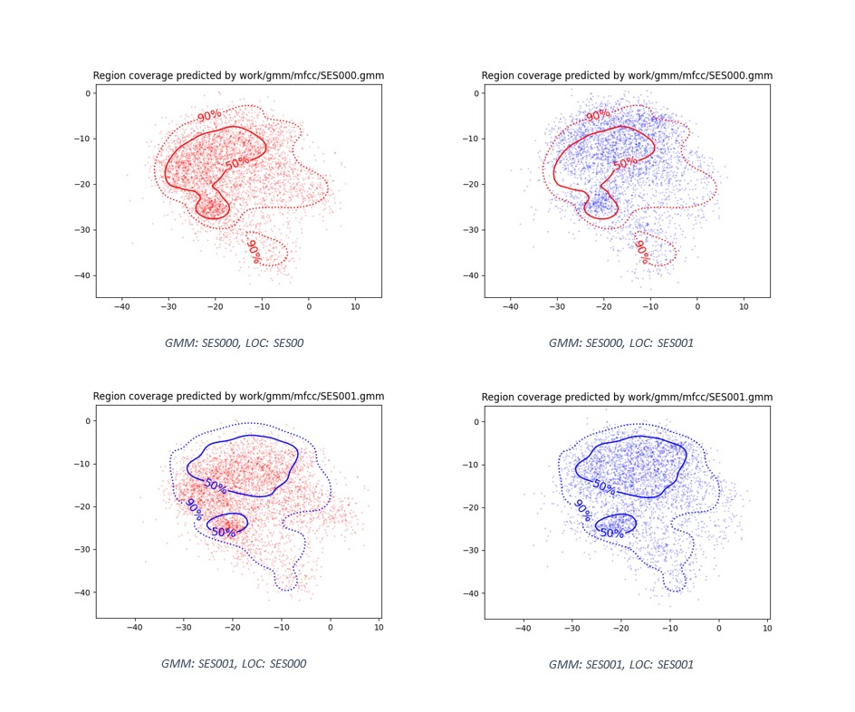

PAV - P4: reconocimiento y verificación del locutor
===================================================

Obtenga su copia del repositorio de la práctica accediendo a [Práctica 4](https://github.com/albino-pav/P4)
y pulsando sobre el botón `Fork` situado en la esquina superior derecha. A continuación, siga las
instrucciones de la [Práctica 2](https://github.com/albino-pav/P2) para crear una rama con el apellido de
los integrantes del grupo de prácticas, dar de alta al resto de integrantes como colaboradores del proyecto
y crear la copias locales del repositorio.

También debe descomprimir, en el directorio `PAV/P4`, el fichero [db_8mu.tgz](https://atenea.upc.edu/pluginfile.php/3145524/mod_assign/introattachment/0/spk_8mu.tgz?forcedownload=1)
con la base de datos oral que se utilizará en la parte experimental de la práctica.

Como entrega deberá realizar un *pull request* con el contenido de su copia del repositorio. Recuerde
que los ficheros entregados deberán estar en condiciones de ser ejecutados con sólo ejecutar:

~~~~~~~~~~~~~~~~~~~~~~~~~~~~~~~~~~~~~~~~~~~~~~~~~~~~~.sh
  make release
  run_spkid mfcc train test classerr verify verifyerr
~~~~~~~~~~~~~~~~~~~~~~~~~~~~~~~~~~~~~~~~~~~~~~~~~~~~~

Recuerde que, además de los trabajos indicados en esta parte básica, también deberá realizar un proyecto
de ampliación, del cual deberá subir una memoria explicativa a Atenea y los ficheros correspondientes al
repositorio de la práctica.

A modo de memoria de la parte básica, complete, en este mismo documento y usando el formato *markdown*, los
ejercicios indicados.

## Ejercicios.

### SPTK, Sox y los scripts de extracción de características.

- Analice el script `wav2lp.sh` y explique la misión de los distintos comandos involucrados en el *pipeline*
  principal (`sox`, `$X2X`, `$FRAME`, `$WINDOW` y `$LPC`). Explique el significado de cada una de las 
  opciones empleadas y de sus valores.

    * **sox**: Comando de shell que permite leer y escribir ficheros de audio, de los fomratos mas populares, puede, de manera opcional aplicar efectos en estos. Como combinar distintintos fuentes de input, sintetizar el audio, y en muchos sistemas actua de forma general como un reproductor de audio o para grabar multiples pistas.
    Nosotros hemos usado en el fichero `wav2lp`:
      - El formato con la opción `-t` seleccionando _raw_ es decir, le decimos que tanto el inpput como el output queremos que sea del tipo raw.
      - El tipo codificación de los datos con la opción `-e` selccionando _signed_ que són signed integers.
      - En ell tamaño con `-b` hemos puesto 16. Indicando que el tamaño cada trama codificada resultante ha de ser de 16 bits.

    * **X2X**: Función de SPTK, que permite transformar los datos de una input a otro tipo de datos, como se puede ver por el nombre, de los datos X 2 (to) los datos X.
      - Hemos seleccionado `+sf`, es decir que de datos _short_ (2 bytes) pase a _float_ (4 bytes).

    * **Frame**: Función de SPTK que convierte la sequencia de datos en input, a una serie de tramas de periodo P, puede ser que estas se sobrepongan entre ellas.
      - En la opción `-l` 240, que es el tamaño que queremos en las tramas resultantes.
      - En `-p`, emos puesto 80, que significa que el periodo de las tramas resultante es de 80, podemos ver que se sobreponen.
    
    * **Window**: Función de SPTK que multiplpica elemento por elemento el input por una ventana, parametrizada en las opciones.
      - En la opción `-l` hemos puesto 240, que es el tamaño de la trama de input.
      - En el tamaño de la trama de ouput hemos puesto `-L` 240, por tanto no recortamos.
      - En la opción `-w` que es el tipo de ventana, no hemos puesto nada, por tanto se aplica la ventana por defecto, _Blackman_.
    
    * **LPC**: Función de SPTK que calcula los coeficientes lpc de longitud L del fichero de input, pasando el resultado en output.
      - Opción `-l`, longitud de la trama: 240 (como hemos puesto anteriormente).
      - Opción `-m`, que indica el orden de los coeficientes, lo pasasmos con una varibale que la tenemos fijada a 20.

- Explique el procedimiento seguido para obtener un fichero de formato *fmatrix* a partir de los ficheros de
  salida de SPTK (líneas 45 a 47 del script `wav2lp.sh`).

  El proceso es el siguente, primero definimos el nuemro de columnas, `ncol` como el orden de los coeficientes LPC mas uno, `ncol=lpc_order+1` ya que el primer valor que devuelve la función LPC corresponde a la ganancia y no al primer coeficiente, estos empiezan el segundo.
  Ahora definimos el nuemro de filas nrow, llamando al `X2X +fa` para pasar de float a ASCII del fichero $base.lp del cual solo imprimimos las lineas con `wc -l` y usamos perl con `-ne` que ejecuta en bucle un print de `$_/'$ncol'` es decir que printe para cada fila (row) la columnas que hay en fichero `$base.lp` y luego hace `\n` para pasar a la siguente linea y volver para tantas lineas (rows) como tenga `$base-lp`.

  * ¿Por qué es conveniente usar este formato (u otro parecido)? Tenga en cuenta cuál es el formato de
    entrada y cuál es el de resultado.

    El fomato en forma de _fmatrix_ es conveniente ya que para cada vez que calculamos los coeficientes LPC se nos devuelve un vector, y como tenemos que realizar este calculo muchas veces, ponerlo en formato matriz es ideal: 
    Para un locutor que tiene mcuhos audios, tenemos solo un fichero `.lp` para cada audio, aunque tengamos mas de una trama por audio, porque lo guardamos en forma de matriz, sinó obtendriamos un fichero distinto `.lp` para cada trama de cada audio de cada locutor, que són demasiados arichivos.

- Escriba el *pipeline* principal usado para calcular los coeficientes cepstrales de predicción lineal
  (LPCC) en su fichero <code>scripts/wav2lpcc.sh</code>:

  El pipeline usado el el siguente:
  `sox $inputfile -t raw -e signed -b 16 - | $X2X +sf | $FRAME -l 240 -p 80 | $WINDOW -l 240 -L 240 -w 0 |`
	`$LPC -l 240 -m $lpc_order | $LPCC -m $lpc_order -M $cepstrum_order > $base.lpcc`

- Escriba el *pipeline* principal usado para calcular los coeficientes cepstrales en escala Mel (MFCC) en su
  fichero <code>scripts/wav2mfcc.sh</code>:

  El pipeline usado el el siguente:
  `sox $inputfile -t raw -e signed -b 16 - | $X2X +sf | $FRAME -l 240 -p 80 | $WINDOW -l 240 -L 240 |`
	`$MFCC -a 0.97 -c 22 -e 1 -s 8 -l 240 -L 256 -m $mfcc_order -n $mfcc_channelOrder -w 1 > $base.mfcc`
### Extracción de características.

- Inserte una imagen mostrando la dependencia entre los coeficientes 2 y 3 de las tres parametrizaciones
  para todas las señales de un locutor.
  
  Dependencia entre los coeficientes LP 2 y 3.
  
  

  Dependencia entre los coeficientes LPCC 2 y 3.
  
  

  Dependencia entre los coeficientes MFCC 2 y 3.
  
  
  
  + Indique **todas** las órdenes necesarias para obtener las gráficas a partir de las señales 
    parametrizadas.
    <code>
    plot_gmm_feat -x 2 -y 3 work/gmm/lp/SES000.gmm work/lp/BLOCK00/SES000/*
    plot_gmm_feat -x 2 -y 3 work/gmm/lpcc/SES000.gmm work/lpcc/BLOCK00/SES000/*
    plot_gmm_feat -x 2 -y 3 work/gmm/mfcc/SES000.gmm work/mfcc/BLOCK00/SES000/*
    </code>
    
  + ¿Cuál de ellas le parece que contiene más información?
  Los parametros MFCC son los que aprecen contener más información. Su mayor dispersion nos indica la 
  independencia de unos valores respecto a otros, lo cual nos indica que cada coeficiente MFCC nos aporta
  mucha más información que uno de LP o LPCC

- Usando el programa <code>pearson</code>, obtenga los coeficientes de correlación normalizada entre los
  parámetros 2 y 3 para un locutor, y rellene la tabla siguiente con los valores obtenidos.

  |                        | LP     | LPCC   | MFCC   |
  |------------------------|:------:|:------:|:------:|
  | &rho;x[2,3] |-8.22944|0.198087|0.056964|
  
  + Compare los resultados de <code>pearson</code> con los obtenidos gráficamente.
  Estos resultados confirman lo obtenido graficamente, pues muestra que los coeficientes mfcc son los que 
  tienen una correación menor, o dicho de otra manera, mayor independencia.
  
- Según la teoría, ¿qué parámetros considera adecuados para el cálculo de los coeficientes LPCC y MFCC?
  Para los coefientes LPCC, segun la teoría deberíamos usar 13 coeficientes MFCC con entre 24 y 40 filtros 
  frecuenciales. Para los coeficientes LPCC, deberíamos usar 20 coeficientes con un cepstrum del orden 30.

### Entrenamiento y visualización de los GMM.

Complete el código necesario para entrenar modelos GMM.

- Inserte una gráfica que muestre la función de densidad de probabilidad modelada por el GMM de un locutor
  para sus dos primeros coeficientes de MFCC.
  
  
  
- Inserte una gráfica que permita comparar los modelos y poblaciones de dos locutores distintos (la gŕafica
  de la página 20 del enunciado puede servirle de referencia del resultado deseado). Analice la capacidad
  del modelado GMM para diferenciar las señales de uno y otro.
  
  
  Se puede observar como ambos locutores obtienen modelos suficientemente disitintos como para permitir una
  distinción entre ambos bastante buena.

### Reconocimiento del locutor.

Complete el código necesario para realizar reconociminto del locutor y optimice sus parámetros.

- Inserte una tabla con la tasa de error obtenida en el reconocimiento de los locutores de la base de datos
  SPEECON usando su mejor sistema de reconocimiento para los parámetros LP, LPCC y MFCC.

### Verificación del locutor.

Complete el código necesario para realizar verificación del locutor y optimice sus parámetros.

- Inserte una tabla con el *score* obtenido con su mejor sistema de verificación del locutor en la tarea
  de verificación de SPEECON. La tabla debe incluir el umbral óptimo, el número de falsas alarmas y de
  pérdidas, y el score obtenido usando la parametrización que mejor resultado le hubiera dado en la tarea
  de reconocimiento.
 
### Test final

- Adjunte, en el repositorio de la práctica, los ficheros `class_test.log` y `verif_test.log` 
  correspondientes a la evaluación *ciega* final.

### Trabajo de ampliación.

- Recuerde enviar a Atenea un fichero en formato zip o tgz con la memoria (en formato PDF) con el trabajo 
  realizado como ampliación, así como los ficheros `class_ampl.log` y/o `verif_ampl.log`, obtenidos como 
  resultado del mismo.
