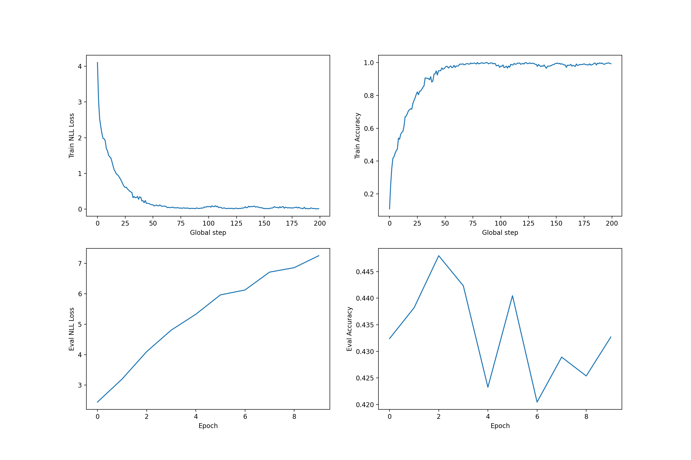
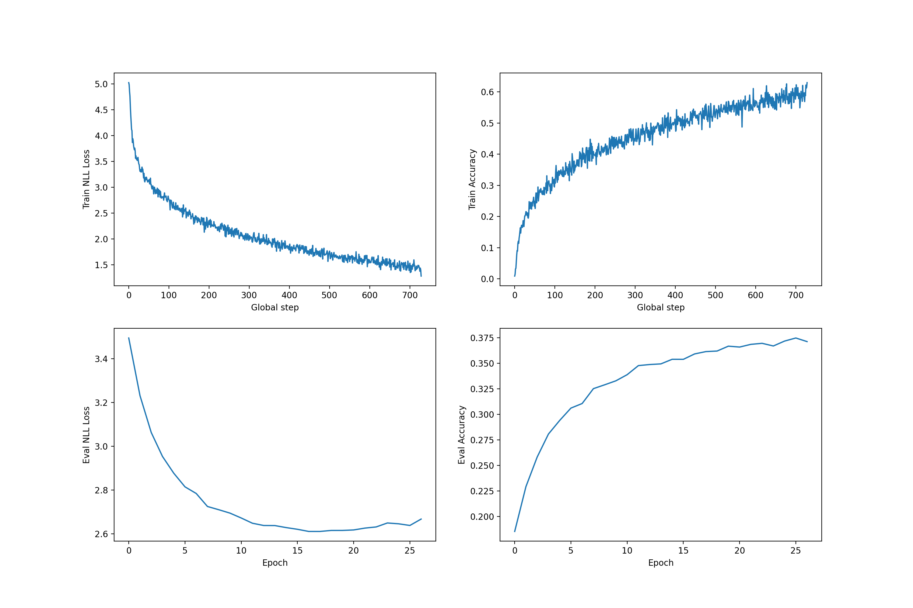

# PAV Speaker Classification and Verification with Deep Neural Networks

This is an implementation of https://github.com/santi-pdp/pav_spkid_pytorch. The objective of this project is to implement a speaker identifier using Neural Networks over a previously calculated feature vector. Additionally to the classifier function for which that program was designed, a verification function has been added. Our neural network works with an input feature vector, designated under the variable `FEAT` that can be: 

  - `lp` for Linear Prediction Coeficients.
  - `lpcc` for Linear Prediction Cepstral Coefficients.
  - `mfcc` for Mel Frequency Cepstral Coefficients.
  
Then, with the structure of a Multi Layer Perceptron, and the optimized weights, it can classify a speaker as one of the trained classes or it can verify it's identity. For this part, we have been inspired by the publications of [1], [2], [3] and [4].
  
## Training
The training in our program is performed though the command : `FEAT=<feature> run_spkid train_nn`. Where `<feature>` must be one of the three choices for the feature vector we implemented.

Training a neural network is not an easy task, as overfitting and underfitting problems are pretty common [5]. The objective is to design a model that is able to achieve the best results on a given task and that can be later generalized to other unknown data. The problems faced here are those of escaping local minima and dealing with the previously mentioned overfitting and underfitting problems.

For our proposed model, we used 256 hidden layers with 20 feature units per layer. The idea is that a deeper network will allow to use more non-linear information. A deeper or wider network did not improve the results. Actually, as there are more parameters to optimize, it turned out to perform worse. A bigger network also proved to suffer from overfitting, which we could detect on the training results. When overfitting, the loss and accuracy of the training data will shoot up, getting up to near 0 loss and 100% accuracy. At the same time, validation loss will start to grow, and validation accuracy will not have the same 100% value. This means that the networks is "memorizing" the training data, and so not able to properly generalize what it has learned. More on that topic on [6] and [7]. An example of overfitting case would look something like this:

We performed the training with a batch size of 1000 using the Adam optimizer and a 0.0001 learning rate. The Adam optimizer [8], is one that has proven significant improvements over the Stochastic Gradient Descent optimizer for neural networks. The learning rate was chosen to be a low value, as according to [9], a lower value helps escaping the local minima and tends to be less prone to overfitting. The data we used is that of the SPEECON database [10], which was divided on a 75% training, 12.5% validation and 12.5% test. The results of the training process can be observed on the following plot:

  
### CUDA Acceleration
To train the model, we needed more performance than the CPU can offer, as training these models can take quite a lot of time, especially when you take on consideration the amount of times you want to perform the training in order the achieve the optimal hyperparameters. So, the best solution was to train it on our GPU, a Nvidia RTX 2060. By using the graphics card, we managed to reduce the computing time between three and four times.

The problem we faced here was that we are using WSL 2 for programming on Linux, whose support for GPUs is still being developed. For that reason, we had to update to the latest build on development, only available through Windows Insider Program (and on the dev channel). We do not recommend anyone this option currently, as this version may have instabilities and some bugs. For more information about the procedure to install CUDA on WSL, follow this link: https://docs.nvidia.com/cuda/wsl-user-guide/index.html

## Classification
The classification task can be performed with the command `FEAT=<feature> run_spkid test_nn`. Then, the command `FEAT=<feature> run_spkid classerr_nn` must be executed to calculate the error rate of the classification.

With our model we obtained a 1.28% error rate.

## Verification
To perform the verification, the command `FEAT=<feature> run_spkid verify_nn` must be run, followed by the command `FEAT=<feature> run_spkid verif_err_nn` to evaluate the verification results.

To implement this option, which was not present in the original `pav_spkid_pytorch` code, a modified version of the classification script was implemented. On this version, instead of returning the maximum of the last layer after the softmax algorithm, the script will return the value corresponding to the probability of a given class [1].

On the verification task, our model managed to achieve a 0.0 cost detection score.

## Optimization
Once finished the implementation on neural networks, we encounter another problem, optimization.

To perform the training a batch size, learning rate and other fields have to be set before computing, ideally the optimal values must be found and set as an initial condition to compute.

The objective is to find these optimal values, we are in need of an optimization algorithm.

For our requirements, the ones that better adjust are the Particle Swarm Optimization (PSO) [11], [12] and the proposed Artificial Bee Swarm Optimization algorithm (ABSO) [13]. We choose the later because as they expose in the paper:

*The success of an optimization algorithm depends strongly on the ability of providing a good balance between exploration and exploitation. Exploration refers to generation of new solutions in as yet unseen regions of the search space and exploitation means the concentration of the algorithm’s search at the vicinity of current good solutions. The inability of the algorithm to make a good balance between exploration and exploitation leads to premature convergence, getting trapped in a local optima, and stagnation.*

And the ABSO algorithm excels in these areas due to its particular definition of the bee type, and its roles assigned.
The adjustable parameters of the algorithm, are as follows:

- Swarm size is set to 30 which 25 of the bees are onlooker and 5 bees are scout.
- Elite number `n_e  = 5` (selectioned by tournament [14])
- `w_bmax=w_emax=2.5`
- `w_bmin=w_emin=1.5`
- `iter_max=5000`
- `s_max=0.2` and `s_min=0.02`

Python environment is implemented for programming ABSO algorithm to identify the optimal values of our neural network.

During the execution two main issues have been encountered.

The size of the neural network. As the algorithm tries new values the size of the network can exceed the total capacity of the GPU memory.

Another encountered problem during the computation, is related to the computation time that takes each bee to train the model and evaluate, due to its duration we have not been able to get a satisfying result. The total time the algorithm takes to finish (with 30 bees and 5000 iterations) is far from reasonable.
Note that the algorithm might be more interesting a company or organization with bigger infrastructure.

## Bibliography:

[1] G. Heigold, I. Moreno, S. Bengio and N. Shazeer, "End-to-end text-dependent speaker verification," 2016 IEEE International Conference on Acoustics, Speech and Signal Processing (ICASSP), Shanghai, 2016, pp. 5115-5119, doi: 10.1109/ICASSP.2016.7472652.

[2] Bing Xiang and T. Berger, "Efficient text-independent speaker verification with structural Gaussian mixture models and neural network," in IEEE Transactions on Speech and Audio Processing, vol. 11, no. 5, pp. 447-456, Sept. 2003, doi: 10.1109/TSA.2003.81582

[3] D. Snyder, P. Ghahremani, D. Povey, D. Garcia-Romero, Y. Carmiel and S. Khudanpur, "Deep neural network-based speaker embeddings for end-to-end speaker verification," 2016 IEEE Spoken Language Technology Workshop (SLT), San Diego, CA, 2016, pp. 165-170, doi: 10.1109/SLT.2016.7846260.

[4] SNYDER, David, et al. Deep Neural Network Embeddings for Text-Independent Speaker Verification. En Interspeech. 2017. p. 999-1003.

[5] D. Stathakis (2009) How many hidden layers and nodes?, International Journal of Remote Sensing, 30:8, 2133-2147, DOI: 10.1080/01431160802549278

[6] DIETTERICH, Tom. Overfitting and undercomputing in machine learning. ACM computing surveys (CSUR), 1995, vol. 27, no 3, p. 326-327.

[7] GOODFELLOW, Ian J.; VINYALS, Oriol; SAXE, Andrew M. Qualitatively characterizing neural network optimization problems. arXiv preprint arXiv:1412.6544, 2014.

[8] KINGMA, Diederik P.; BA, Jimmy. Adam: A method for stochastic optimization. arXiv preprint arXiv:1412.6980, 2014.

[9] M. Bahaghighat, F. Abedini, M. S’hoyan and A. Molnar, "Vision Inspection of Bottle Caps in Drink Factories Using Convolutional Neural Networks," 2019 IEEE 15th International Conference on Intelligent Computer Communication and Processing (ICCP), Cluj-Napoca, Romania, 2019, pp. 381-385, doi: 10.1109/ICCP48234.2019.8959737.

[10] ISKRA, Dorota, et al. Speecon-speech databases for consumer devices: Database specification and validation. 2002.

[11] BAI, Qinghai. Analysis of particle swarm optimization algorithm. Computer and information science, 2010, vol. 3, no 1, p. 180.

[12] CHEN, Ching-Yi; YE, Fun. Particle swarm optimization algorithm and its application to clustering analysis. En 2012 Proceedings of 17th Conference on Electrical Power Distribution. IEEE, 2012. p. 789-794.

[13] AKBARI, Reza; MOHAMMADI, Alireza; ZIARATI, Koorush. A novel bee swarm optimization algorithm for numerical function optimization. Communications in Nonlinear Science and Numerical Simulation, 2010, vol. 15, no 10, p. 3142-3155.

[14] YANG, Jiaping; SOH, Chee Kiong. Structural optimization by genetic algorithms with tournament selection. Journal of Computing in Civil Engineering, 1997, vol. 11, no 3, p. 195-200.
